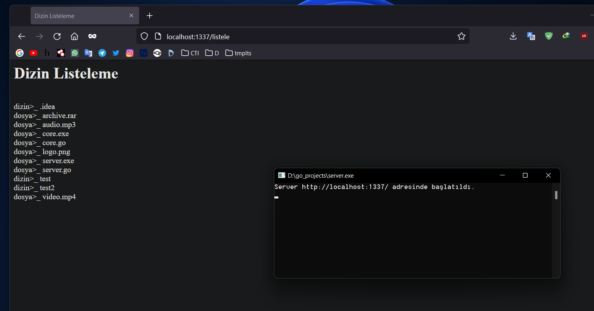

# List Files and Directories with GoLang based HTTP Server
core.go needs [mux] (https://github.com/gorilla/mux) library.

# TO MAKE IT WORK:
`go run server.go`  or `go build core.go`

# TO BUILD:
`go build server.go` or `go build core.go`
